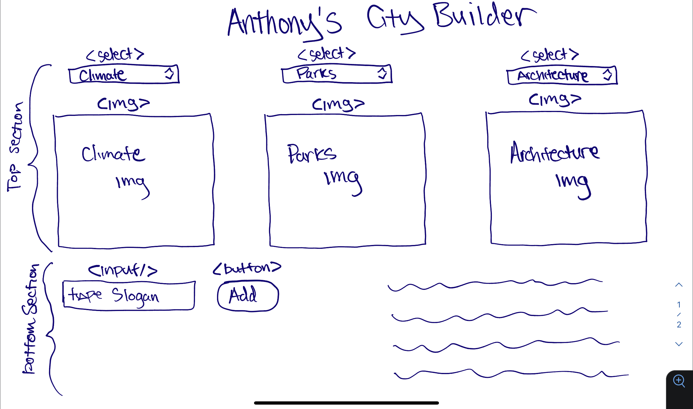

## HTML Setup

-   Top Section
    -   3x dropdown menus for climate, parks, and architecture <select>
    -   3x images for climate, parks, and architecture 
-   Bottom Left Section
    -   User input box for slogans <input>
    -   "add" button to submit slogan and add to the list <button>
-   Bottom Right Section
    -   div to hold p elements created from JS based on user entry 

## State

-   3x images
-   city slogans
